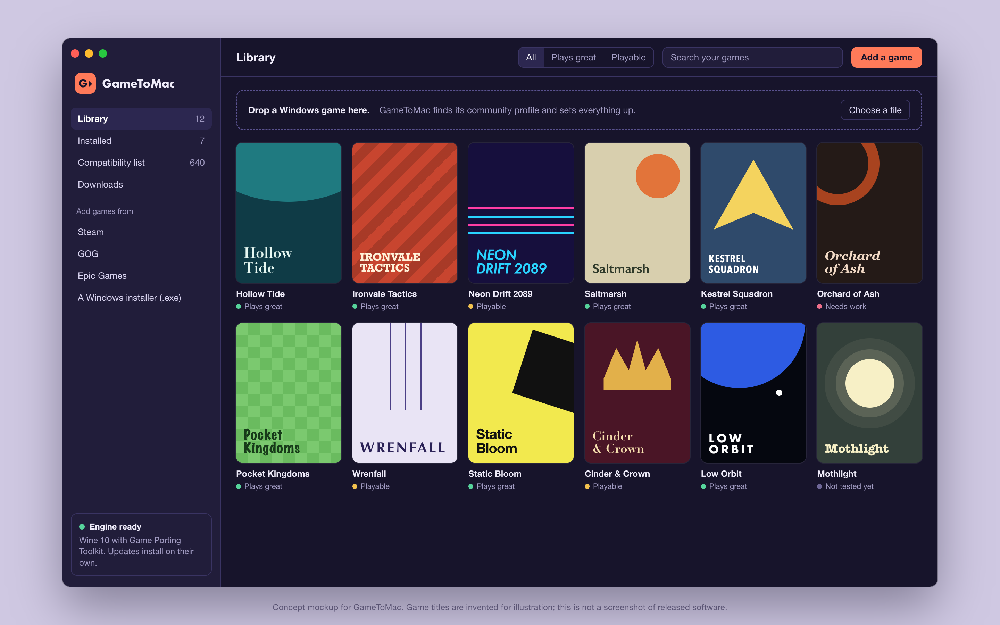
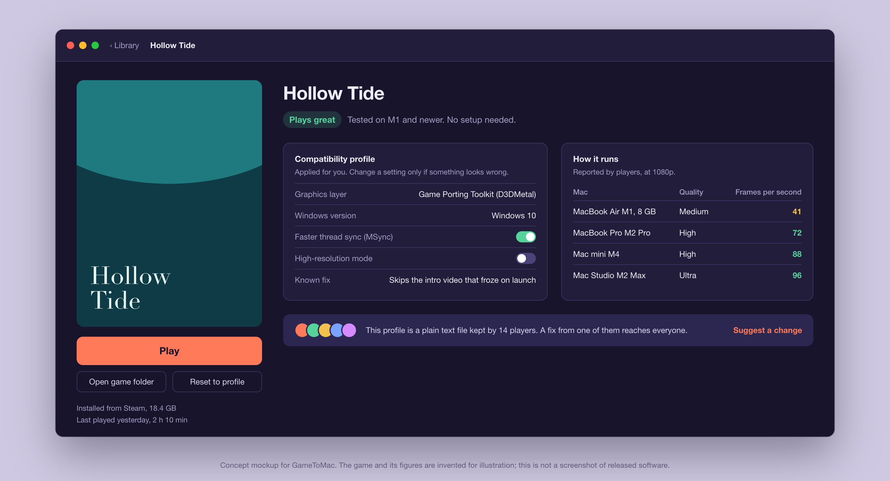
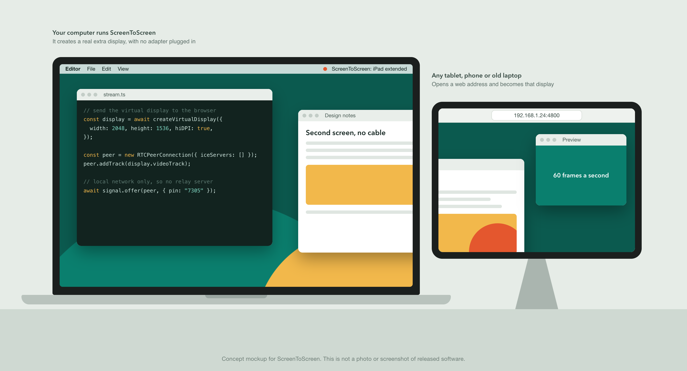
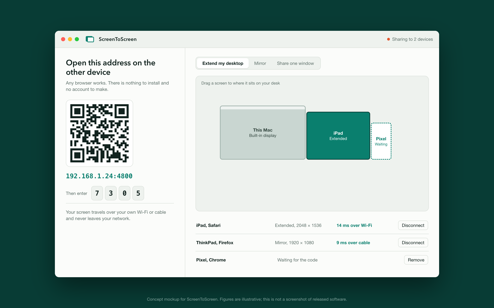
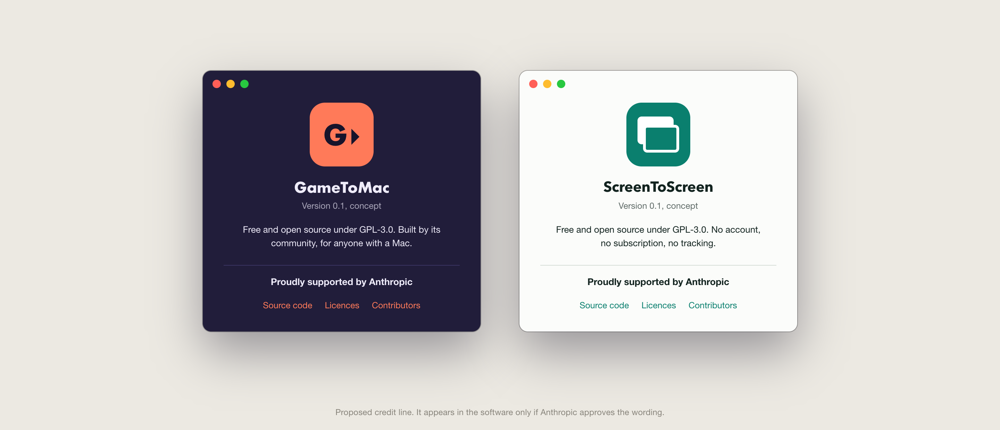

# GameToMac and ScreenToScreen

Two free, open-source apps that do jobs people currently pay for: running Windows games on a Mac, and using a spare tablet, phone or laptop as a second screen.

This repository is the proposal for both projects, written for Anthropic's [Claude for Open Source](https://claude.com/contact-sales/claude-for-oss) program. A two-page version is in [`docs/proposal.pdf`](docs/proposal.pdf).

> **Where things stand.** Both projects are at the design and prototype stage. Nothing has been released yet, and there are no download numbers to report. Every image on this page is a concept mockup, and the games and figures shown in them are invented. The code repositories will be opened under this account as the first working builds land.



## The short version

| | GameToMac | ScreenToScreen |
|---|---|---|
| What it does | Runs Windows games on a Mac with one click | Turns any device with a browser into a second screen |
| Paid software it stands in for | CrossOver | Duet Display, Luna Display |
| Who it is for | Mac owners who want to play games they already own | Students, remote workers, anyone with an old tablet in a drawer |
| Licence | GPL-3.0 | GPL-3.0 |
| Price | Free, permanently | Free, permanently |

## GameToMac

### The gap

Apple silicon Macs are capable gaming machines, and Wine plus Apple's Game Porting Toolkit can already run a large share of the Windows catalogue on them. The hard part is setup: picking a Wine build, choosing a graphics layer, and finding the handful of settings each game needs.

CrossOver solves that well, and its maker, CodeWeavers, funds much of Wine's development. It is also a paid product, which puts it out of reach for a lot of students and casual players.

The best-known free option was [Whisky](https://github.com/Whisky-App/Whisky). It collected close to 15,000 GitHub stars, which is a fair measure of how many people want this. Its maintainer archived it in April 2025, and it no longer receives Wine updates or game fixes. Community forks exist, but there is no free, maintained app with a shared compatibility database behind it. GameToMac is meant to be that.

### How it works



- **Drop in a game, press Play.** GameToMac recognises the game, downloads the right engine, and applies the settings that are known to work.
- **Compatibility profiles are plain text files in a public repository.** Each one records the graphics layer, Windows version, tweaks and known fixes for one game. When one player solves a problem, the fix reaches everyone on the next refresh.
- **Honest ratings.** Every game is marked "Plays great", "Playable", "Needs work" or "Not tested yet", with frame rates reported by players on named Mac models.
- **Works with the stores people already use.** Steam, GOG, Epic Games, or a plain Windows installer.
- **Open all the way down.** Wine, DXVK and MoltenVK form the fully open path. Apple's Game Porting Toolkit is used where Apple's licence allows it, downloaded from Apple rather than bundled if that is what the terms require.

### First release

A signed Mac app for Apple silicon, the profile format and its public repository, and a starting set of tested profiles. The goal for the first six months is 100 verified games, then to grow the list through community reports.

## ScreenToScreen



### The gap

Using a tablet as a second monitor usually means a subscription (Duet Display), a hardware dongle (Luna Display), or staying inside one vendor's devices (Apple's Sidecar only works between a recent Mac and a recent iPad).

[Deskreen](https://github.com/pavlobu/deskreen) proved the browser approach works and deserves credit for it. Two things hold it back: a true extended desktop needs a dummy display adapter plugged into the computer, and newer features are planned for a paid edition. ScreenToScreen aims to create the extra display in software, with no adapter, and to keep every feature in the open version.

### How it works



- **The other device needs nothing installed.** It opens a web address or scans a code, enters a four-digit number, and becomes a display.
- **Three modes.** Extend the desktop, mirror it, or share a single window.
- **A real extra display, made in software.** A virtual display on each operating system (an indirect display driver on Windows, a virtual display on macOS, a virtual output on Linux) so no adapter is needed.
- **Stays on the local network.** Video goes straight from the computer to the browser over WebRTC. There is no relay server, no account and no tracking.
- **Works over Wi-Fi or a cable,** with latency shown for each connected device.

### First release

A host app for macOS and Windows, the browser client, and extend, mirror and single-window modes. Linux follows. One known risk is stated up front: macOS has no public API for virtual displays, so that part relies on the same private interface other display tools use, and may need rework when Apple changes it.

## Six-month plan

| Months | GameToMac | ScreenToScreen |
|---|---|---|
| 1 and 2 | Engine manager, game detection, profile format published | Browser client and host streaming over WebRTC, mirror mode |
| 3 and 4 | Public alpha, first 40 tested profiles, contributor guide | Virtual display on Windows and macOS, extend mode, public alpha |
| 5 and 6 | 100 tested profiles, store integrations, signed release | Single-window mode, Linux host, signed release |

Both projects will use public issue trackers and tagged releases from the first alpha, so progress can be checked by anyone.

## How Claude would be used

This is a very small team taking on two projects with wide technical surfaces. Claude Max would go to:

- **Compatibility work.** Each game that fails is its own investigation through Wine logs, graphics-layer traces and crash dumps. This is the largest share of the work and the part that benefits most from Claude Code.
- **The hard systems code.** Windows display drivers, macOS virtual displays, low-latency video encoding, and WebRTC tuning.
- **Tests and continuous integration** across macOS, Windows, Linux and mobile browsers.
- **Documentation and contributor onboarding,** so that people who are not engineers can submit a compatibility profile.
- **Reviewing community contributions** quickly enough that contributors stay.

## What we commit to

- Both apps stay free and open source under GPL-3.0, so nobody can close the code and sell it.
- Anthropic's support is credited in each README, in the notes of every release, and in each app's About window.
- A public write-up of how Claude was used to build them, including what did not work.



The wording "Proudly supported by Anthropic" is a proposal. It will appear in the software only if Anthropic approves it, in whatever form Anthropic prefers, and Anthropic's logo will not be used without permission.

## Who is behind this

Alex, a web developer who runs Smola Designs in Kitchener, Ontario, Canada.

- GitHub: [Mr-McMuffin](https://github.com/Mr-McMuffin)
- Email: alex@smoladesigns.com
- Project names and future homes: GameToMac.ca and ScreenToScreen.ca

## About this repository

```
README.md            this proposal
docs/proposal.pdf    two-page version
mockups/*.png        concept mockups
mockups/src/         the HTML and CSS the mockups are rendered from
mockups/render.py    renders the mockups with headless Chrome
```

The text and mockups in this repository are released under [CC BY 4.0](LICENSE). The apps themselves will be GPL-3.0.

GameToMac and ScreenToScreen are independent projects. They are not affiliated with CodeWeavers, Apple, Duet, Astropad, Valve or any other company named here, and those names are used only to describe what exists today.
